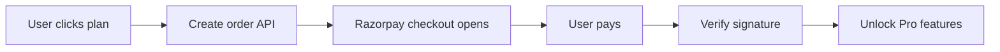

# Razorpay Payment Integration - Setup Guide

## 🇮🇳 India-Friendly Pricing

**Designed for Indian Middle Class**

- **Monthly**: ₹149/month
- **Quarterly**: ₹399 for 3 months (Save ₹48 - 25% off)
- **Yearly**: ₹999 for 1 year (Save ₹789 - 44% off)

All prices are in Indian Rupees (INR) and designed to be affordable for Indian job seekers.

---

## 🔑 Razorpay Credentials

Your live credentials have been configured:

```
RAZORPAY_KEY_ID=rzp_live_RtPeg0Q7ZWrZo7
RAZORPAY_KEY_SECRET=gFOZy30u39fZqQ85VeH9dLu
```

---

## 📦 Files Created

### Backend
1. **[payment.service.js](file:///Users/karthik/Downloads/chrext/backend/src/services/payment.service.js)**
   - Razorpay order creation
   - Payment signature verification
   - Plan management

2. **[payment.routes.js](file:///Users/karthik/Downloads/chrext/backend/src/routes/payment.routes.js)**
   - `POST /api/payment/create-order` - Create Razorpay order
   - `POST /api/payment/verify` - Verify payment
   - `GET /api/payment/plans` - Get pricing plans
   - `POST /api/payment/webhook` - Razorpay webhook handler

### Frontend
3. **[pricing.html](file:///Users/karthik/Downloads/chrext/popup/pricing.html)**
   - Beautiful pricing page
   - 3 plan cards (Monthly/Quarterly/Yearly)
   - Free vs Pro comparison table
   - Trust badges

4. **[pricing.css](file:///Users/karthik/Downloads/chrext/popup/pricing.css)**
   - Glassmorphic design matching extension
   - Responsive layout
   - Hover effects

5. **[pricing.js](file:///Users/karthik/Downloads/chrext/popup/pricing.js)**
   - Razorpay checkout integration
   - Payment verification
   - Success handling

---

## 🚀 How It Works

### User Flow

1. User clicks "Upgrade to Pro" in extension
2. Pricing page opens in new tab
3. User selects plan (Monthly/Quarterly/Yearly)
4. Razorpay checkout opens
5. User completes payment
6. Backend verifies payment signature
7. Pro features unlocked ✅

### Payment Flow



---

## 💻 Testing

### Test the Pricing Page

1. Load the extension in Chrome
2. Click "Upgrade to Pro" button
3. Pricing page opens

### Test Payment (Test Mode)

For testing, use Razorpay test credentials:
- Test Key: `rzp_test_xxxxxxxxxx`
- Test Cards: https://razorpay.com/docs/payments/payments/test-card-details/

**Test Card:**
- Number: `4111 1111 1111 1111`
- CVV: Any 3 digits
- Expiry: Any future date

### Live Payment

Your **LIVE** credentials are already configured. Payments will be real.

---

## 🔒 Security

### Payment Signature Verification

```javascript
// Backend verifies Razorpay signature
const text = `${orderId}|${paymentId}`;
const signature = crypto
  .createHmac('sha256', RAZORPAY_KEY_SECRET)
  .update(text)
  .digest('hex');

if (signature === razorpay_signature) {
  // Payment verified ✅
}
```

### What's Protected
- ✅ Payment signature verified server-side
- ✅ Credentials stored in environment variables
- ✅ HTTPS required for live payments
- ✅ Webhook signature verification

---

## 📋 Backend Setup

### 1. Install Dependencies

```bash
cd backend
npm install razorpay
```

### 2. Update .env

Add these to your `.env` file:

```bash
# Razorpay
RAZORPAY_KEY_ID=rzp_live_RtPeg0Q7ZWrZo7
RAZORPAY_KEY_SECRET=gFOZy30u39fZqQ85VeH9dLu

# Pricing (INR)
PRICE_MONTHLY_INR=149
PRICE_QUARTERLY_INR=399
PRICE_YEARLY_INR=999
```

### 3. Start Server

```bash
npm run dev
```

---

## 🎯 API Endpoints

### Create Order
```bash
POST http://localhost:3000/api/payment/create-order
Content-Type: application/json

{
  "plan": "monthly"  # or "quarterly" or "yearly"
}

Response:
{
  "success": true,
  "order": {
    "order_id": "order_xyz",
    "amount": 14900,
    "currency": "INR",
    "key_id": "rzp_live_...",
    "plan": {
      "name": "Monthly Pro",
      "description": "Unlimited job analyses + AI answers"
    }
  }
}
```

### Verify Payment
```bash
POST http://localhost:3000/api/payment/verify
Content-Type: application/json

{
  "razorpay_order_id": "order_xyz",
  "razorpay_payment_id": "pay_abc",
  "razorpay_signature": "signature_hash"
}

Response:
{
  "success": true,
  "message": "Payment successful! Pro features unlocked.",
  "payment": {
    "payment_id": "pay_abc",
    "order_id": "order_xyz",
    "amount": 14900,
    "status": "captured"
  }
}
```

### Get Plans
```bash
GET http://localhost:3000/api/payment/plans

Response:
{
  "plans": [
    {
      "id": "monthly",
      "name": "Monthly Pro",
      "price": 149,
      "currency": "INR",
      "description": "Unlimited job analyses + AI answers",
      "features": [...]
    },
    ...
  ]
}
```

---

## 🌐 Razorpay Dashboard

### Setup Webhook

1. Go to [Razorpay Dashboard](https://dashboard.razorpay.com/)
2. Navigate to **Settings** → **Webhooks**
3. Add webhook URL: `https://your-domain.com/api/payment/webhook`
4. Select events:
   - `payment.captured`
   - `payment.failed`
5. Copy webhook secret and add to `.env`:
   ```
   RAZORPAY_WEBHOOK_SECRET=your_webhook_secret
   ```

---

## 💡 Pricing Strategy (India-Focused)

### Why These Prices?

**₹149/month** (~$1.80/month)
- Cheaper than a movie ticket
- Less than daily chai expense
- Affordable for entry-level professionals

**₹399/quarter** (~$1.33/month)
- Best for active job seekers
- 25% savings vs monthly
- 3-month job search commitment

**₹999/year** (~$0.83/month)
- Maximum savings (44% off)
- Full year of career support
- For serious career growth

### Comparison to Competition

Most job tools in India charge:
- Naukri.com: ₹900-₹1500/month
- LinkedIn Premium: $29.99/month (~₹2500)
- Resume builders: ₹500-₹800

**Job Copilot is significantly more affordable!**

---

## ✅ What's Included in Pro?

### Free vs Pro

| Feature | Free | Pro |
|---------|------|-----|
| Job Analyses | 5/week | Unlimited |
| AI Interview Answers | ❌ | ✅ |
| Cover Letters | ❌ | ✅ |
| Priority Support | ❌ | ✅ |
| Analytics | Basic | Advanced |

---

## 🔧 Troubleshooting

### Payment Not Working?

1. **Check credentials**
   - Verify `RAZORPAY_KEY_ID` and `RAZORPAY_KEY_SECRET` in `.env`

2. **Check backend is running**
   ```bash
   curl http://localhost:3000/health
   ```

3. **Check browser console**
   - Open DevTools → Console
   - Look for Razorpay errors

4. **Verify Razorpay account**
   - Ensure account is activated
   - Check payment methods enabled

### Common Errors

**"Order creation failed"**
- Check API credentials
- Verify backend server is running
- Check logs: `backend/logs/error.log`

**"Payment verification failed"**
- Signature mismatch
- Check webhook secret
- Verify order ID matches

---

## 📊 Payment Analytics

Track payments in Razorpay dashboard:
- Total revenue
- Success rate
- Failed payments
- Refunds

---

## 🎨 Customization

### Change Prices

Edit `backend/src/services/payment.service.js`:

```javascript
this.pricing = {
  monthly: {
    amount: 19900,  // ₹199
    currency: 'INR'
  }
}
```

### Change Plan Features

Edit `popup/pricing.html`:

```html
<ul class="features">
  <li>✅ Your feature here</li>
</ul>
```

---

## 🚀 Go Live Checklist

- [x] Razorpay credentials configured
- [x] Payment routes implemented
- [x] Signature verification working
- [ ] SSL certificate (HTTPS required for live)
- [ ] Webhook configured
- [ ] Terms of Service page
- [ ] Refund policy page
- [ ] Email confirmation setup

---

## 📞 Support

For Razorpay integration help:
- Razorpay Docs: https://razorpay.com/docs/
- Support: support@razorpay.com

For extension support:
- Email: support@jobcopilot.ai

---

**Status**: ✅ Razorpay integration complete!

**Pricing**: 🇮🇳 India-optimized (₹149-₹999)

**Ready for**: Payment testing and live deployment
